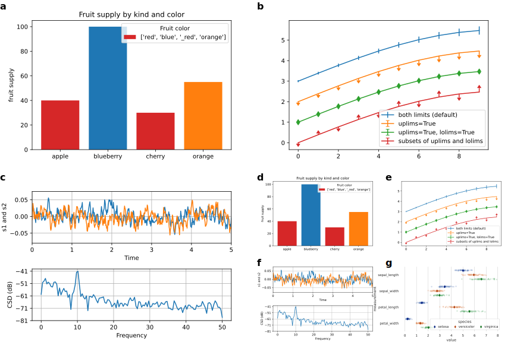

# Figure_Panel

Create figure panel for publications from svg files.

# Installation
```
pip install pip install git+https://github.com/muhammedhasan/figure_panel.git
```

# Usage
```bash
figure_panel -f x.svg,y.svg,z.svg -o fig.pdf --width 1200 --fontsize 24
```

`-f` input svg files separated by `,` indicating figure arrange in the same row
`--width` of figure in pixels and height determined based on the aspect ratio. `--fontsize` is relative to width so need adjustment accordingly.

`-o` output format `.svg`, `.png` and `.pdf` is supported.


```bash
figure_panel -f "[x.svg,y.svg],[z.svg, k.svg]" -o fig.pdf
```

`[]` indicates row in the panel. Figures labeled based on the sequence order in the input.


```bash
figure_panel -f "[x.svg, y.svg],[z.svg, [[x.svg, y.svg], [z.svg, k.svg]]]" -o fig.pdf
```



See [examples](examples/example.ipynb) for further examples and python api.


## TODOS

- [] Add more test-cases
- [] Margin between figures
- [] Padding between figures and labels